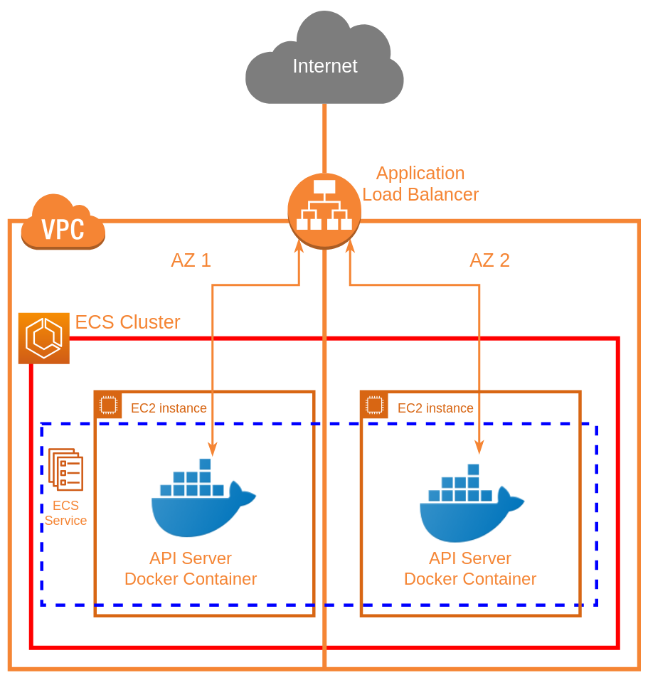

AWS provides a lot of great services, but it can often be confusing or unclear how to put together various resources in order to create one cohesive system/service.

In this post, I'm going to describe the process of creating an AWS Elastic Container Service (ECS)-based API microservice which will automatically scale under load. This can be really useful for horizontally scalable API services which either already are, or can be easily containerized with Docker.

If you don't want to read about alternatives, you can skip straight to [The ECS Solution](#the-ecs-solution).

## The Motivation and Alternatives

I want to start out this post by discussing why this solution would make sense for certain environments, as well as alternatives which may be better suited for certain types of applications/services.

The scenario I'll be referring to throughout this post is a RESTful API-based service which will be exposed to the internet, although this could certainly be applied to other server-client microservices as well.

There are lots of reasons why one might need a microservice with autoscaling. The cloud has helped revolutionize elastic allocation of resources, allowing for an application be able to spin up/down its own resources as appropriate, relevant to load. This lets us more tightly allocate resources for a service, while still allowing autoscaling so that bursty performance doesn't cripple the service. This also means that (for the most part), you don't have to really think about scaling your application depending on its environment, or while the service gets more demand since you can set everything up to take care of itself from the beginning.

### AWS Lambda with API Gateway

One AWS-native solution for an autoscaling microservice is utilizing an AWS Api Gateway which has routes that are served by AWS Lambdas. Software like the [Serverless Framework](https://serverless.com/framework/docs/providers/aws/guide/quick-start/) make this a very easy solution to get some basic code up and running behind an API. The main benefits of this solution are that you don't have to worry about scaling at all, since it's just a bunch of AWS Lambdas being invoked, and it's really easy to get started. This also has the upside of being 'serverless', which basically just means it utilizes all managed services so you don't have to worry about much besides the code itself.

This solution does have a few downsides, however:

* AWS Lambdas take time to invoke. Especially if they're not 'hot', there can be significant delay between invoking a function, and seeing it actually start running. [There are even some weird 'hacks'](https://www.jeremydaly.com/lambda-warmer-optimize-aws-lambda-function-cold-starts/) written around invoking a lambda in order to keep it warm and responsive because this can be such a problem in some scenarios.
* Things like caching are very difficult and limited with Lambdas because they are so ephemeral.
* Persistent connections to the api for highly concurrent calls can be difficult because your connection to the API Gateway is really just a proxy to a lambda invocations, with all of its own scaling implications.
* With large volumes of requests, or high compute requirements, [lambdas can be more expensive](https://www.simform.com/aws-lambda-pricing/) than simply hosting a large api server, or cluster of api servers.
* Coding an API microservice like this means it won't be easily portable to other clouds or hosting methods. If doing anything cross-cloud is a concern, then this isn't a great approach.

With this said, applications which aren't sensitive to potentially high latency, don't have consistently high compute cost/usage (but CAN be bursty), and will always live in AWS are good candidates for considering this alternate solution.

### Hosting Microservices With Kubernetes

[Kubernetes has been taking the container/microservice world by storm](https://www.infoworld.com/article/3118345/cloud-computing/why-kubernetes-is-winning-the-container-war.html), and for a good reason. Kubernetes is an amazing container orchestration tool with lots of complexity and flexibility. It really bridges the gap between running a bunch of un-managed hardware and/or VMs, and quickly/easily deploying containers/services with templates. It's sort of like terraform or cloudformation, but for containers in the form of jobs or services.

Once you have a stable cluster, it's extremely easy to design/use applications within the cluster. Kubernetes also has 'microservice' embedded in its DNA, with tons of options for networking/communication between applications running together on a cluster.

The main problem with kubernetes is its massive complexity. It's not necessarily difficult to get a 'hello world' cluster up and running with some containers, but to do it in such a way that's production-ready with best practices, is quite a task. On top of this, even with managed kubernetes services like GKE/EKS/AKS, managing a kubernetes cluster is not a trivial task. Creating and maintaining a cluster isn't a simple 'fire and forget' solution; it often requires constant attention and maintenance. Large kubernetes clusters often require teams of devops to maintain appropriately, which isn't always an option.

## The ECS Solution

The solution I'll be presenting is really a middle-ground between the easy and extremely ephemeral API Gateway+Lambda solution, and the highly complex, but flexible kubernetes solution.

We can achieve this in AWS by utilizing ECS, but more specifically, an [ECS Service](https://docs.aws.amazon.com/AmazonECS/latest/developerguide/ecs_services.html) which is AWS' solution to help you run containers as services on a cluster of EC2s. It really bridges the gap between running a bunch of independent EC2s, and scheduling/running containers as a service.

### Architecture

Below is an architecture diagram demonstrating the solution that will be presented.

Fundamentally, we have a VPC which contains an autoscaling ECS cluster, which itself contains an ECS service that runs the API server container across the cluster, exposed to the internet via an Application Load Balancer.

This also lets us perform TLS termination at the load balancer, so we don't have to provide the API servers with TLS certificates directly (they can talk over standard HTTP), and we can even use [ACM](https://aws.amazon.com/certificate-manager/) for free certificates of custom domains with the load balancer, if desired.

Note that the architecture diagram doesn't show the autoscaling components. Those are provided via CloudWatch Alarms/Triggers and Scaling Policies with Autoscaling Groups. ECS reports its average CPU utilization for the cluster to CloudWatch, which we use to trigger scaling. Also note that while this diagram only shows 2 Availability Zones and 2 EC2s, this could be any combination of AZs (within the same region), as well as any number of EC2s (depending on the scaling).

### Usage Requirements

In order to use this solution, you must first meet these few requirements:

* Have an AWS account with a VPC that has at least 2 'public' subnets (I'm considering a public subnet one who's default route to the internet goes through an internet gateway, NOT a NAT (this is the default when creating new VPCs/subnets)). Note the region, Availability Zones, VPC ID, and Subnet IDs for these resources, as they will all need to be provided as parameters.
* Have a dockerized API that talks over standard HTTP (not HTTPS), and contains a 'health check' path. (A 'health check' path is simply a path that will return an HTTP 200 when a plain GET request is preformed on it (the return body doesn't matter))
* Have this API in either a public docker repository, or in [AWS ECR](https://aws.amazon.com/ecr/)
* Have the necessary IAM permissions to spin up the resources needed for this solution (including other IAM roles)

### Deployment

The problem with an ECS service, is that it's very limited in configuration by itself, and doesn't come with a lot of options to help facilitate autoscaling. As such, we are forced to combine and link together many different AWS resources, configured in a particular way in order to enable horizontal autoscaling.

Because so many AWS resources must be combined together to achieve this, [AWS Cloudformation](https://aws.amazon.com/cloudformation/) is going to be an essential tool in deploying and configuring our service. As such, I've made a parameterized cloudformation template for deploying this stack.



Easy ways to deploy this template are either through the AWS Cloudformation Console, (where you can upload the template file, and fill in parameters using the site), or by using `aws cloudformation deploy` with the AWS cli. Either way, you should look at all the parameters and select appropriate values when deploying or it may not work.

For the initial deployment/stack creation, you can simply overwrite the default parameter values in the template file, however note that for future updates, overwriting a parameter requires it to be explicitly passed in as a new parameter, rather than simply changing the default value in the template itself (i.e. using the `--parameter-overrides` flag with `aws cloudformation deploy` in the cli).

Also note: The container you specify as parameters must already exist and be uploaded/available in your specified container repository BEFORE you try to deploy the stack.

#### Update Considerations

In order to update your service to a new version of your container, there are 2 approaches.

1. Use a container with a version tag like '1.4.3', and update the TaskDefinition, which will trigger a new ECS deployment (RECOMMENDED)
1. Use a container with a static tag like 'latest', and always have ECS pull the newest container automatically (NOT RECOMMENDED)

If you use a container tagged with a version, then when you update your container version, all you have to do is update the cloudformation stack with a new parameter for `containerTag`, and CloudFormation will take care of everything for you. It will start a new ECS Service deployment, which will drain the connections from your existing containers and replace them with the new version as a rolling update until all of your containers are up to date. This method makes it so there is no manual intervention needed, and cloudformation stack rollbacks will also automatically rollback your version of the running app as well, which can come in handy when something goes wrong.

If you use a container with a static tag that you update like 'latest' then you must release your app as soon as you push up a new container. This also makes rollbacks a more difficult and a more manual process if something goes wrong with your new container. If you still choose to go this route, then after updating your container, you will have to force a new deployment of the ECS service, which will cause the latest containers to be deployed as a rolling update on the cluster. You can do this easily through the console (make sure to check 'Force new deployment' when updating the service), or with the cli `aws ecs update-service` using the `--force-new-deployment` flag.

Note that in either of these situations, ECS can take a while to finish updating the service. This will also block the cloudformation stack from finishing updating until the rolling update is complete. For quicker development times, I've found it faster to terminate all of the EC2s in the ECS cluster, and let the autoscaling group bring them back up automatically, rather than waiting for ECS to drain connections of the stopping tasks. It should go without saying that you should never do this in production, but it can help enable faster development times without having to wait quite as long for a new service to fully deploy with new containers.

### Configuration

This section has some useful information on how to configure the template to specific requirements. Note that this template also has many features that are not enabled by default, but which may be considered useful which will also be explained.

#### Required Parameters

Note that all of these are required for the stack to work at all, and some are further described in [Usage requirements](#usage-requirements).

* `containerRegistry`: This is the registry where your API docker container is located. For docker hub images, leave this as docker.io. If you are using ECR, you can put in the ECR endpoint here ({accountId}.dkr.ecr.{region}.amazonaws.com), just make sure to also un-comment the lines relating to ECR IAM permissions (lines 309-320 in the template).
* `containerName`: This is the name of the container in the docker registry from above.
* `containerTag`: This is the particular tag of the container to pull for the service. Note that for normal use, you'll likely want a 'pinned' tag, (i.e. a version number, and not 'latest'), otherwise you can end up with a mix of different version containers running behind the load balancer.
* `applicationPort`: This is the port that your API server listens on (i.e. the EXPOSE port on a docker container). Note this is NOT going to necessarily be the publicly exposed port.
* `healthCheckPath`: This is the path for the health check of the API server as described in [Usage Requirements](#usage-requirements).
* `region`: This is the region of the VPC you plan to use.
* `vpcid`: This is the id of the VPC you plan to use.
* `pubsubnet1`: This is the first subnet within the VPC you want to use for the load balancer/EC2s.
* `pubsubnet2`: This is the second subnet within the VPC you want to use for the load balancer/EC2s.
* `az1`: This is the availability zone corresponding to `pubsubnet1`.
* `az2`: This is the availability zone corresponding to `pubsubnet2`.

#### Recommended Parameters

These parameters don't technically have to be changed for the stack to be deployed, but it is strongly recommended that you do (or at least verify the existing defaults are sufficient).

* `service`: This is simply the name of the service you want to deploy. Most resources created by the stack use this parameter in their own logical names.
* `ec2Size`: This is the [EC2 Instance Type](https://aws.amazon.com/ec2/instance-types/) to use for the ECS cluster. Because we use the [Daemon ECS Scheduling Strategy](https://docs.aws.amazon.com/AmazonECS/latest/developerguide/ecs_services.html#service_scheduler_daemon), each API server container will essentially get a 'dedicated' EC2 to run on. This means the amount of resources that the ec2 instance receives will directly correspond to the amount of resources each API container instance will get.
* `maxClusterSize`: This is the max number of EC2s that your ECS cluster is allowed to autoscale up to. This is simply to restrict resource usage if you don't want the API to scale 'infinitely' (along with your AWS bill).
* `stage`: This is a 'stage' name (like 'dev', or 'prod', although it can be any string you want). This is used so that more than one of these stacks can be deployed and differentiated for the same service.
* `scaleDownCpuThreshold`: This is the scale down threshold of the average combined CPU usage across ALL of your running API servers. If your service drops below this usage number, it will automatically scale down.
* `scaleUpCpuThreshold`: This is the scale up threshold of the average combined CPU usage across ALL of your running API servers. If your service rises below this usage number, it will automatically scale up.

#### Optional Parameters

All of these parameters are used to help enable optional features that are commented out in the template by default. Rather than list the individual parameters, this section will talk about the features and why/how to enable them in the template.

##### Enable SSH Access for the EC2s in the ECS Cluster

This feature is strongly recommended, and required to be able to ssh into the EC2s that are backing the ECS cluster (and running the API containers). Without this, you will never be able to get into the EC2 to do any debugging if needed.

For this, you simply need to have an EC2 key pair existing in the region corresponding to your vpc, then use the key pair name for the `ec2Key` parameter, and un-comment the KeyName in the AutoScaling LaunchConfiguration (line 240 in the template).

##### Enable public IPv6 support for the API

In order to enable public IPv6 support for the load balancer, you must first ensure that your public subnets for the template (`pubsubnet1` and `pubsubnet2`) have IPv6 blocks assigned to them, and your VPC support it. This is NOT the default configuration for VPCs, although you can [migrate existing VPCs to support IPv6](https://docs.aws.amazon.com/vpc/latest/userguide/vpc-migrate-ipv6.html#vpc-migrate-ipv6-cidr) if you wish.

Once you have confirmed that your specified VPC/Subnets have IPv6, simply change the load balancer IpAddressType to 'dualstack' on line 358 of the template.

##### Enable TLS termination (HTTPS support) for the API

TLS termination allows your API to be served over HTTPS (even though your actual API server containers use normal HTTP). This is a feature of the Application Load Balancer, and requires a TLS certificate to use for this HTTPS connection. You must use an [ACM](https://aws.amazon.com/certificate-manager/) certificate, although you can upload custom certificates to ACM if needed.

Get the ARN for your ACM certificate, and use it for the `acmCertificateArn` parameter, then un-comment the Certificates section in the load balancer listener (lines 382-386), and comment out the old conflicting Port/Protocol (lines 379-380).

Note that this will completely disable public access to the API over standard HTTP, and requires an HTTPS connection, exclusively.

##### Automatically add a custom domain name for the API (with Route 53)

A custom domain name for an API is often desired, instead of the default one that AWS assigns for the load balancer. In order to use this feature with the template, the DNS of the domain for the URL you wish to assign must ALREADY exist and be managed by [Route 53](https://aws.amazon.com/route53/) in your AWS account. If you don't already manage your domain DNS with Route 53, you can choose to [migrate your DNS](https://docs.aws.amazon.com/Route53/latest/DeveloperGuide/MigratingDNS.html) if desired.

Find the Hosted Zone ID where the url DNS record will live, and put it in the `route53ZoneId` parameter, then fill the `url` parameter with your desired URL for the api.

Now un-comment the Route 53 record set to add it to the stack (lines 397-405). If you've also [enabled public IPv6 support](#ipv6-support), then you should also un-comment the IPv6 (AAAA) DNS record (lines 407-415).

##### Add more availability zones

The template was only created to support 2 availability zones with 2 subnets. In many cases, it's desirable to use more availability zones. This can be easily expanded by adding additional `pubsubnet#` and `az#` parameters, then referencing the added parameters in the following:

* Autoscaling Group `AvailabilityZones` (line 121)
* Autoscaling Group `VPCZoneIdentifier` (line 129)
* LoadBalancer `Subnets` (line 368)

Note that while you can add availability zones via new subnets, they still must all reside within the same VPC.

### Logging

Logs for the running containers can be accessed via the [CloudWatch Console](https://console.aws.amazon.com/cloudwatch/home). The template automatically creates a new log group called `/ecs/{serviceName}/{stageName}` where ECS will place container logs. Each container will get its own log stream within this log group.

Note that logs for the ECS scheduler can be found under the 'Events' tab, when looking at the details page of the ECS Service within the ECS Cluster.

## Conclusion

AWS provides the services necessary to have an autoscaling API microservice with ECS. All of the resources and configuration needed in order to bring a service up/down can be provided through CloudFormation as a convenient way to manage the service as a whole.

This can allow a containerized API to be extremely flexible with its underlying resource usage, thus helping to expand when in demand, and save money when not.

I welcome any comments below!
