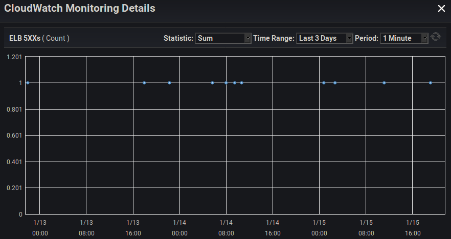
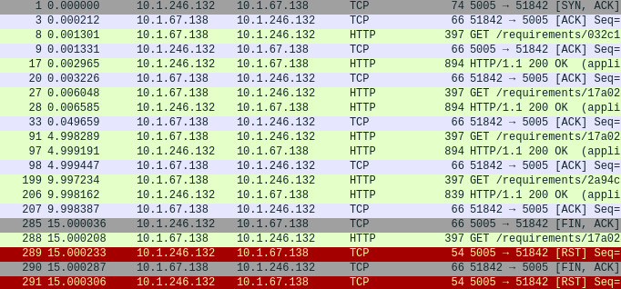

Creating and deploying API servers is a space with a lot of options and many different ways to achieve the same end-result in both development and operations.

In this post, I'm going to describe my experience with debugging intermittent HTTP 502 responses from [NodeJS Express](https://expressjs.com/) servers fronted by an AWS Application Load Balancer (ALB), and present the solution to solve these intermittent 502 errors.

If you're already familiar with Express and AWS ALB, you can skip to [The 502 Problem](#the-problem)

## Using Express

First of all, I will preface this by saying that Express is not my first choice when it comes to web frameworks. [Express is not particularly performant](https://www.techempower.com/benchmarks/#section=data-r17&hw=ph&test=query) as far as web frameworks are concerned. This is mainly being attributed to being written in javascript, and most other choices for web frameworks will usually lead to a much better end-user experience for performance-minded applications. With that said, Express is simple, and as such very easy to quickly create and stand up a service in a hurry; you can even start a server in just 4 simple lines:

```javascript
const express = require('express');
const app = express();

app.get('/', (req, res) => res.send('Hello World!')); // Add our api route
app.listen(8180); // Start server and listen on port 8180
```

With this in mind, Express can provide a good first iteration for a web service if other parts of the backend are already written in javascript (or some derivation like typescript).

Performance can also be supplemented if the server can be written in a scalable way so that multiple servers can be run at the same time, and put behind a load balancer.

## Using AWS ALB

AWS provides a variety of load balancers to use for various applications. Their Application Load Balancer is nice to use for web servers since it handles Layer 7 HTTP support. It also can handle TLS termination, so your load balancer can expose HTTPS to the public while your backend doesn't necessarily need a TLS certificate.

They are relatively simple, but don't have a ton of logging options, which can make debugging HTTP 5XX errors a bit difficult.

## The 502 Problem<a name="the-problem"></a>

While running an Express server using (NodeJS 8+) behind an ALB under moderate load (at least ~15 requests per minute, although more apparent under higher loads), you can start to observe occasional 500-range errors on the ALB.



Unfortunately, AWS doesn't present an easy way to discover what 500-range error the load balancer is giving, but getting some sort of the client to continuously hit the webserver and log responses can reveal that (in this case), the errors we are seeing are HTTP 502 errors.

An HTTP 502 error in this context means that the load balancer made a request to the backend Express server, but received some sort of invalid response. This is, unfortunately, a relatively ambiguous error that basically just means the load balancer is claiming that "it's not my fault, the server I was trying to talk to messed up".

## The Debugging

### Logging With Code

The first step that must occur after discovering that we are having intermittent 502's is to try to obtain some sort of insight as to where the error is occurring. For all we know, the error could be with the networking stack of the operating system running the Express server (although this is very unlikely). It's best to work from the top down, starting with our code we added to our Express server.

Unfortunately, setting up logging for a route (such as the 'hello world' example above), reveals that none of our code is even getting executed when the 502's are occurring. (We don't see the console logged 'hello world' on the server when a client receives a 502).

This means we'll have to dig deeper, unfortunately enabling logging on the Express app (`app.use(logger('dev'));`) yielded the same results where we still don't see the request anywhere in our application.

### OS-Level Network Packet Capture

Without wanting to make any further assumptions about what part of the stack has a bug, I decided to pull out `tcpdump` in order to capture TCP packets to gain insight on what might be occurring. Because I haven't seen any indication of the request from the ALB even reaching the Express server yet, I want to at least see if the OS running the server is receiving any packets for these requests receiving 502's.

In order to do this, I simply SSH'd into the Linux machine running the Express server, and ran `tcpdump -w capture.pcap -i eth0`, waiting until I noticed another 502 reported by a client, and stopping the capture.

### Analyzing The Packet Capture

Now FINALLY we've gained some new insight, as opening the packet capture (with some tool such as [wireshark](https://www.wireshark.org/)) reveals some strange TCP RST packets around the time of the 502's.

For anyone unaware, TCP has a few common flags set in a packet, in order to indicate what type of operation that packet is responsible for in the TCP protocol. Talking about networking protocols can be a rabbit hole, so I'll try to keep it to a minimum here.

Anyways, a TCP packet that is being sent with the RST flag set means that the sender of this packet doesn't recognize the TCP connection that the other host was trying to communicate to the sender with. This can happen for a number of reasons, but one reason is that the person sending the RST flag has ungracefully closed their network socket because they didn't want to receive any more data over that connection.

With this being my first assumption, I tried to look for supporting evidence, which didn't take long. I took the individual connection (TCP stream) which contained the RST flag and isolated it with wireshark filters to reveal these packets:



It appears that our server is sending a FIN TCP packet (#285) (indicating that it is closing the TCP connection), JUST before receiving an HTTP request from the load balancer (#288). After receiving this HTTP request from the load balancer, the networking stack running on the OS of the server sends an RST TCP packet (#289), informing the load balancer that it doesn't know about the TCP connection that it's trying to communicate over, and is thus refusing the connection.

This is DEFINITELY what's causing our 502's, as the load balancer makes an HTTP request over a TCP connection to the server that has already been closed, but not yet acknowledged as closed by the load balancer.

So from the server's perspective, it forcefully destroys the connection by essentially refusing to receive any further data, and only then sending a packet to inform the other host that the connection is closed. Unfortunately, while this 'closure' (FIN) packet is being sent to the load balancer, the ALB has already sent another request to be processed by the server. This happens because from the load balancer's perspective, the connection was still open when it sends the request, and only received the closure notice after the request is in transit. This is due to the fact that networks have inherent latency, so a host at either end of a connection can be sending data at the exact same time, and be unaware of this fact until later, after the packets have arrived at their destinations.

The reason this can occur is because the NodeJS http server is destroying its TCP socket instead of gracefully closing it (waiting for an acknowledgement of the connection closure while still accepting data from the socket).

### Working Back To the Express Server

So now we know that something in NodeJS is destroying its TCP socket before waiting for it to gracefully end, because if it waited for a graceful ending, it would have been able to receive and somehow handle the last request from the ALB instead of sending an RST packet.

After investigating Express, it becomes apparent that Express isn't really handling much on the socket-layer, so it must be the underlying native Node [http.Server](https://nodejs.org/api/http.html#http_class_http_server) that Express uses. And sure enough, [in the docs](https://nodejs.org/api/http.html#http_server_keepalivetimeout) (new with NodeJS 8.0+), is a 'keepAliveTimeout', which will forcefully destroy a socket after having a TCP connection sit idle for a default 5 seconds.

This means that after only 5 seconds of idling, the Node http.Server ungracefully destroys TCP sockets which is why, even though intermittent, the 502's were noticeable. Simply having these be more sensible defaults would've avoided this whole problem to begin with, but at least we know the problem now.

In order to solve this problem, unfortunately because the Node http.Server doesn't gracefully close its TCP sockets/connections from an idle keep-alive timeout, we HAVE to rely on the AWS ALB to be the one prompting the closure of individual TCP connections to the server. Fortunately, ALBs have an easily accessible setting called 'idle timeout' for just that purpose, which defaults to 60 seconds, and is configurable.

## The Solution

There are basically 2 factors at play which require configuring to avoid these 502's:

1. The `keepAliveTimeout` of the native NodeJS http.Server returned by Express
1. The idle timeout setting of the ALB

In order to avoid this problem, the idle timeout of the ALB simply must be lower than the keepAliveTimeout of the Node http.Server. Please note that the value for the Node http.Server `keepAliveTimeout` is in milliseconds, whereas the idle timeout setting of the ALB is in seconds.

By default, the idle timeout of an ALB is 60 seconds, which is fairly reasonable for most applications. Assuming we keep this default, here's an example for how to set the keepAliveTimeout of the http server created by Express.

---

**Edit 03/2020:**

As helpfully mentioned in the comments of this post, there is [currently a regression bug](https://github.com/nodejs/node/issues/27363) in the behavior of the `keepAliveTimeout` functionality, that may require _also_ setting the `headersTimeout` of the same NodeJS http.Server object to be above the `keepAliveTimeout`.

This change has been documented in the example below.

---

```javascript
const express = require('express');
const app = express();
// ... routes and whatnot ...
const server = app.listen(80); // Save the output of 'listen' to a variable, which is a Node http.Server

server.keepAliveTimeout = 65000; // Ensure all inactive connections are terminated by the ALB, by setting this a few seconds higher than the ALB idle timeout
server.headersTimeout = 66000; // Ensure the headersTimeout is set higher than the keepAliveTimeout due to this nodejs regression bug: https://github.com/nodejs/node/issues/27363
```

Once that is set, the http server running on the Node server will no longer be the one prompting connections to close (and doing so ungracefully), and thus the problem is solved!

## Conclusion

I made this blog post because it was an obscure issue that wasn't immediately obvious, and while trying to search for this error, I [was led](https://stackoverflow.com/questions/23925284/how-to-modify-the-nodejs-request-default-timeout-time/23926952#23926952) down [A LOT](https://stackoverflow.com/questions/21708208/express-js-response-timeout/21708822#21708822) of [wrong paths](https://stackoverflow.com/questions/12651466/how-to-set-the-http-keep-alive-timeout-in-a-nodejs-server) that [left me](https://stackoverflow.com/questions/23925284/how-to-modify-the-nodejs-request-default-timeout-time) running [in circles](https://stackoverflow.com/questions/12886438/node-js-app-has-periodic-slowness-and-or-timeouts-does-not-accept-incoming-requ) for [a while](https://nodejs.org/api/net.html#net_socket_setkeepalive_enable_initialdelay).

The debugging process was hopefully helpful and insightful to some people, and obviously I hope this post will help avoid unnecessary pain and suffering for someone else in the future.

I welcome any comments below!
